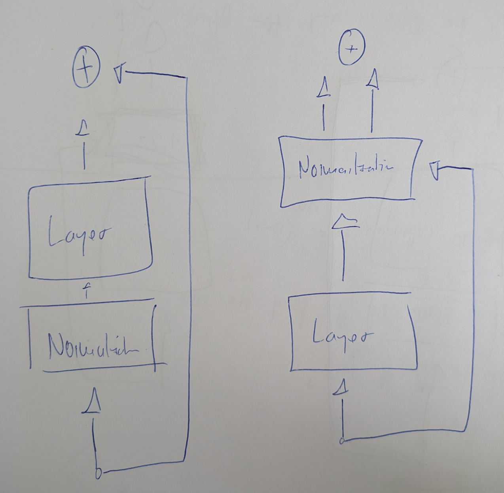

### 1 - Why should layer normalization be condonducted after the computational blocks?

The problem is what happens to your **original information** as it goes through each layer of the network.

***

#### The "Dirty" Way (Post-Layer Normalization)

Imagine you start with a piece of information, let's say a value of **10**. This value goes into a layer.

1.  The layer does some math and produces a new value, say **5**.
2.  The residual connection takes the **original value (10)** and the **new value (5)** and adds them together: `10 + 5 = 15`.
3.  **Here's the problem:** This result (**15**) is then normalized. That means it gets rescaled to a new, different value, maybe **2.5**.
4.  This new value (**2.5**) is passed to the next layer. The **original value of 10 is now gone**. It was combined and then transformed. Over many layers, the original information can get lost.

***

#### The "Clean" Way (Pre-Layer Normalization)

Now, let's start with the same **original value of 10**.

1.  Before the layer does its math, it **first normalizes the input**. The value **10** is converted to **1.2** for internal calculations.
2.  The layer then does its math using **1.2** and produces a new value, say **3**.
3.  The residual connection now takes the **original value (10)** and the **new value (3)** and adds them together: `10 + 3 = 13`.
4.  This new value (**13**) is passed directly to the next layer **without being changed**.

The key difference is that the **original information (10) is preserved** and never modified by the normalization. It travels straight through the network while the layers add their new information on top. This is what a **clean residual stream** means.

##### Summary

In case of a clean residual stream, we do not modify the original information until it is added to normalized outcome of the layer.

In the dirty case, the original information and the outcome of the layer are both normalized and added.

### 2 - Why attention can be seen as a reduce- and MLP as a mapping function

Attention can be thought of as a **reduce** operation because it takes a sequence of inputs and aggregates them into a single, context-aware representation. The MLP, on the other hand, is a **mapping** function because it transforms that aggregated representation into a new, higher-dimensional space, acting on each element of the sequence independently.

***

#### Attention as a Reduce Operation

In a Transformer model, the attention mechanism takes a series of vectors (the tokens in a sentence) and calculates a weighted average of them. Each vector's contribution to the average is determined by its "attention score," which reflects its relevance to the other vectors in the sequence. The end result is a single, new vector for each token that summarizes information from the entire sequence.

For example, when the model is processing the word "bank," it uses attention to figure out if the word refers to a river bank or a financial institution. It does this by "looking at" and "reducing" the information from all the other words in the sentence to build a context-aware representation of "bank."

***

#### MLP as a Mapping Function

After the attention mechanism has created these context-rich representations, the MLP (Multi-Layer Perceptron) acts as a mapping function. It takes each of these new, aggregated vectors and transforms it. It processes each vector individually, performing a series of linear and non-linear operations (like a matrix multiplication followed by a ReLU activation function) to map it to a new vector space. This is where the model can learn and represent more complex, non-linear relationships in the data.

Unlike attention, which considers the entire sequence, the MLP operates on each token's vector independently, enriching its representation before it is passed on to the next layer of the network.

That’s a great idea for a complete summary. Adding the simple example helps ground the abstract concepts of specialization and synthesis.

Here is the cohesive summary, now including the illustrative sample:

***

### 3 - Why are we using multi head attention?

The practice of splitting embeddings by the number of heads in the Transformer architecture's Multi-Head Attention mechanism is driven by two main objectives: **Achieving Diverse Representation** and **Maintaining Computational Efficiency**.

#### 1. The Core Rationale: Diverse Representation

The primary goal is to provide the model with multiple, unique "lenses" or perspectives to analyze the input data simultaneously.

* **Single View Limitation:** A single, large attention mechanism would have to combine all types of linguistic relationships (grammar, context, long-range dependencies) into one set of weights, diluting its focus and limiting its capacity.
* **Specialized Subspaces (The "Split"):** By logically dividing the original $d_{\text{model}}$ dimensional embedding into $h$ smaller $d_k$ dimensional segments ($d_k = d_{\text{model}} / h$), the model creates $h$ independent "heads." Each head learns its **own set of projection matrices** ($W^Q_i, W^K_i, W^V_i$), allowing it to specialize on a different feature subspace.
* **Joint Attendance:** This setup allows the model to capture different aspects of the same token at the same time.

#### Illustrative Example: Resolving Pronoun Ambiguity

Consider the sentence: **"The animal didn't cross the street because $\mathbf{it}$ was too wide."**

| Head | Specialization | Focus on "**it**" | Resulting Insight |
| :--- | :--- | :--- | :--- |
| **Head 1** | **Syntactic Role** | Attends to the noun that fits the grammatical property of being "wide." | Strong signal pointing to **"street"** (animals are not usually described as "wide" in this context). |
| **Head 2** | **Semantic Context** | Attends to the noun that is the logical **cause** of the action (not crossing). | Strong signal pointing to **"street"** (a wide street causes difficulty in crossing). |

The split allows two different, specialized mechanisms to both confirm the reference of "**it**" as "street," resulting in a highly confident and robust final understanding.

#### 2. The Mechanics: How the Split is Handled and Recombined

The term "splitting the embedding" refers to the logical partitioning of the feature space, which is achieved through linear projections and then successfully synthesized:

1.  **Parallel Attention:** $h$ attention calculations are performed concurrently on their $d_k$-dimensional projected vectors, which is efficient and fast.
2.  **Concatenation:** The $h$ resulting output vectors are stacked side-by-side, **re-integrating** all the specialized information to restore the original $d_{\text{model}}$ dimension.
3.  **Final Projection:** A final linear layer learns the optimal way to **synthesize and blend** the specialized insights from all $h$ heads into a single, comprehensive output vector for the next layer.

In essence, Multi-Head Attention splits the learning task across multiple specialists and then effectively combines their expert reports, providing a far richer, multi-angle view of the sequence than a single system could achieve.